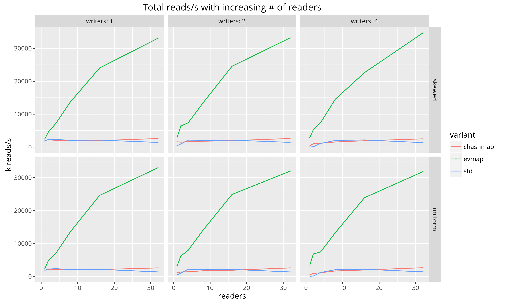
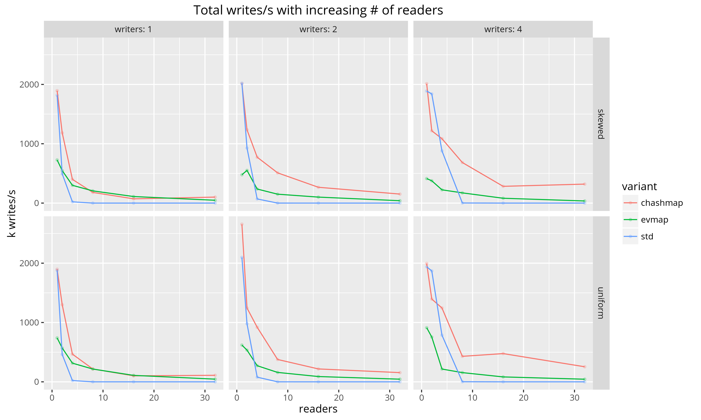
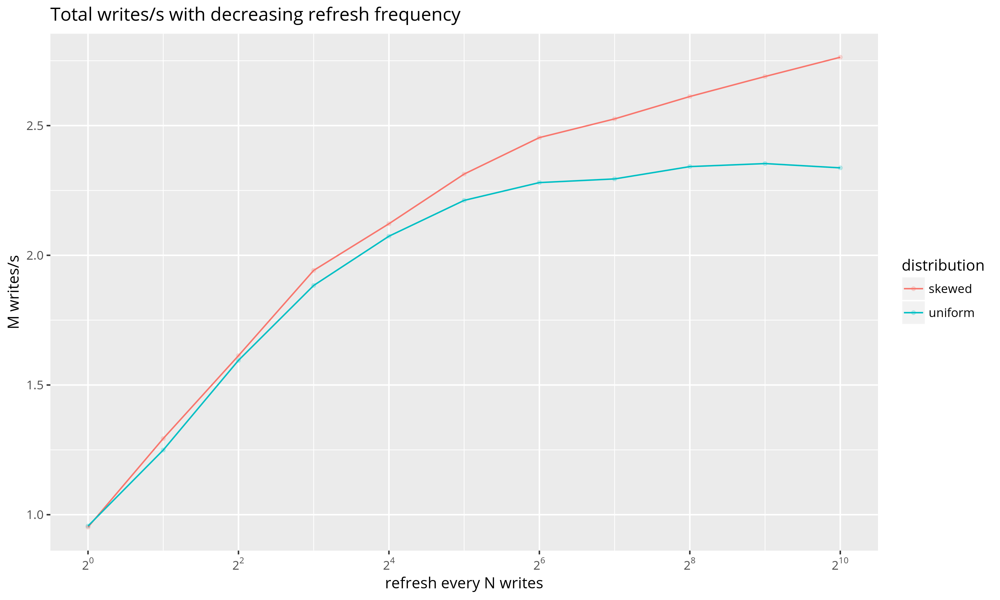

This crate holds the implementation of the `left-right` concurrency
primitive, and its primary user `evmap`. See the documentation for each
crate for details.

Left-right is a concurrency primitive for high concurrency reads over a
single-writer data structure. The primitive keeps two copies of the
backing data structure, one that is accessed by readers, and one that is
access by the (single) writer. This enables all reads to proceed in
parallel with minimal coordination, and shifts the coordination overhead
to the writer. In the absence of writes, reads scale linearly with the
number of cores.

## Performance

**These benchmarks are outdated at this point, but communicate the right
point. Hopefully I'll have a chance to update them again some time
soon.**

I've run some benchmarks of evmap against a standard Rust `HashMap` protected
by a [reader-writer
lock](https://doc.rust-lang.org/std/sync/struct.RwLock.html), as well as
against [chashmap](https://crates.io/crates/chashmap) — a crate which provides
"concurrent hash maps, based on bucket-level multi-reader locks". The
benchmarks were run using the binary in [benchmark/](benchmark/src/main.rs) on
a 40-core machine with Intel(R) Xeon(R) CPU E5-2660 v3 @ 2.60GHz CPUs.

The benchmark runs a number of reader and writer threads in tight loops, each
of which does a read or write to a random key in the map respectively. Results
for both uniform and skewed distributions are provided below. The benchmark
measures the average number of reads and writes per second as the number of
readers and writers increases.

Preliminary results show that `evmap` performs well under contention,
especially on the read side. This benchmark represents the worst-case usage of
`evmap` in which every write also does a `refresh`. If the map is refreshed
less often, performance increases (see bottom plot).

